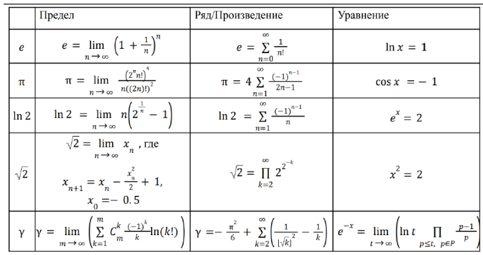

Реализовать функции, вычисляющие значения чисел: e, π, ln2, 2, γ ; с заданной
точностью. Для каждой константы реализовать три способа вычисления: как
сумму ряда, как решение специального уравнения, как значение предела. При
вычислении необходимо использовать ранее вычисленные результаты.

